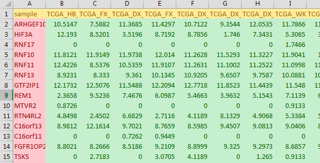

# This code creates a gene signature with the group dataset already made. This code do supervised clustering.

# The dataset must be txt file(tab deliminated) and has the first column as symbol. The numeric gene matrix must start from 2nd columns  

[exmaple file](example_dataset/unsupervisedClustering_TCGA_sarcoma.txt)  


##  Group dataset must have the first column as sample list & the second column as group

[exmaple file](example_dataset/supervisedClustering_group_for_TCGA_sarcoma.txt)  
! [example dataset](example_dataset/groupDataset_supervisedClustering.jpg)  


```{r}

## To install Packages-------------
instPak <- function(pkg){
  new.pkg <- pkg[!(pkg %in% installed.packages()[, "Package"])]
  if (length(new.pkg)) 
    install.packages(new.pkg, dependencies = TRUE)
  sapply(pkg, require, character.only = TRUE)
}

#------------- Packages ----
packages <- c("readr","dplyr","shiny","data.table","gplots","RColorBrewer","reshape2")
instPak (packages) 
#-----------------------------

## Duplicated value removal by SD ---------------
duplicateRemoverbySD <- function(x,startCol=1){
  matrix_data <- as.matrix(x[,-c(1:startCol)])
  sd <- apply(matrix_data,1,sd,na.rm=T)
  order_num <- seq(1:nrow(x))
  transformed <- cbind(order_num,sd,x)
  name_list <- colnames(transformed)
  colnames(transformed) <- paste0("var_",seq(1:ncol(transformed)))
  colnames(transformed)[1:2] <- c("order_num","sd")
  colnames(transformed)[(startCol+2)] <- "grouped"
  res <- transformed %>% arrange(desc(sd)) %>% group_by(grouped) %>% filter(row_number()==1) %>% ungroup() %>% arrange(order_num)
  colnames(res) <- name_list
  return(res[c(-1,-2)])
}
## Transpostion XY----------------
matrixTranspositionXY <- function(x, firstColumnName="sample"){
  col_names_1 <- t(x[1])
  raw_data <- t(x[-1])
  colnames(raw_data) <- col_names_1
  raw_data <- as.data.frame(raw_data)
  row_name_1 <- row.names(raw_data)
  raw_data <- cbind(row_name_1,raw_data)
  row.names(raw_data) <- NULL
  colnames(raw_data)[1] <- firstColumnName
  raw_data[,1] <- as.character(raw_data[,1])
  return(raw_data)
}
# gene median centering
geneMedianCentering <- function(x){
  raw.data <- x[-1] %>% as.matrix()
  median.table <- apply(raw.data ,c(1),median,na.rm = T) 
  median_centered <- raw.data-median.table
  return(cbind(x[1],median_centered))
}


options(shiny.maxRequestSize = 3000 * 1024 ^ 2)
tmpdir <- tempdir()
setwd(tempdir())
print(tempdir())

#UI


ui <-
  fluidPage(
    titlePanel("Extract Gene siganture from the phenotype"),
    sidebarLayout(
      sidebarPanel(
        fileInput(
          'fileRawdata',
          'Choose Gene Expression File',
          accept = c('text/csv',
                     'text/comma-separated-values,text/plain',
                     '.csv')
        ),
        radioButtons('sep1', 'Separator',
                     c(
                       Comma = ',',
                       Semicolon = ';',
                       Tab = '\t'
                     ),
                     '\t'),
        fileInput(
          'fileGroup',
          'Choose Group File',
          accept = c('text/csv',
                     'text/comma-separated-values,text/plain',
                     '.csv')
        ),
        radioButtons('sep2', 'Separator',
                     c(
                       Comma = ',',
                       Semicolon = ';',
                       Tab = '\t'
                     ),
                     '\t'),
        actionButton("actionExtractColumns", "Group extraction", class = "btn-primary"),
        
        selectInput("actionGroup", "Select Group", choices = NULL),
        numericInput("pValue", label = "P value Cutoff", value = 0.001,width = "50%"),
        numericInput("differenceRatio", label = "Group Difference ration", value = 2,width = "50%"),
        
        actionButton("actionExtract", "Extract Signature", class = "btn-primary"),
        actionButton("actionHeatmap", "Create heatmap", class = "btn-primary"),
        br(),
        br(),
        downloadButton('downloadData', 'Download Result')
      ),
      mainPanel(
        htmlOutput("resultFileUpdate"),
        htmlOutput("FilteredGenes"),
        br(),br(),
        plotOutput("Makeheatmap")
      )
    )
  )


server <- function(input, output, session) {
  # data reactive
  datainFileRawdata <- reactive({
    inFile <- input$fileRawdata
    req(inFile)
    f <- fread(inFile$datapath,sep = input$sep1, na.strings="NA") %>% as.data.frame() %>% duplicateRemoverbySD()
    print("raw data uploded")
    return(f)
  })
  datainFileGroup <- reactive({
    inFile <- input$fileGroup
    req(inFile)
    f <- fread(inFile$datapath,sep = input$sep2, na.strings="NA") %>% as.data.frame()
    print("group data uploded")
    return(f)
  })
  data.groupRearranged <- reactive({
    raw.groupdata <- datainFileGroup()
    colnames(raw.groupdata)[c(1,2)] <- c("sample","group")
    raw.groupdata$group <- as.character(raw.groupdata$group)
    raw.groupdata$group[raw.groupdata$group!=input$actionGroup] <- "zTheOthers"
    raw.groupdata$group <- as.character(raw.groupdata$group)
    raw.groupdata <- raw.groupdata %>% arrange(group)
    raw.groupdata$group <- as.factor(raw.groupdata$group)
    
    print("group rearranged")
    return(raw.groupdata)
  })
  dataFilteredTable <- reactive({
    data.process <- datainFileRawdata()
    data.process_1<- matrixTranspositionXY(data.process)
    groupdata <- data.groupRearranged()
    
    a_group <- groupdata %>% filter(group==input$actionGroup) 
    b_group <- groupdata %>% filter(group=="zTheOthers")
    print("group divided")
    data.process_1_a <- inner_join(a_group,data.process_1,by=c("sample"="sample"))[-2] %>% matrixTranspositionXY()
    data.process_1_b <- inner_join(b_group,data.process_1,by=c("sample"="sample"))[-2] %>% matrixTranspositionXY()
    res.table <- matrix(nrow = 1,ncol = 2)
    data.process_1_a_m <- data.process_1_a[c(2:ncol(data.process_1_a))] %>% as.matrix()
    data.process_1_b_m <- data.process_1_b[c(2:ncol(data.process_1_b))] %>% as.matrix()
    for (i in 1:nrow(data.process_1_a)) {
      k_1 <- data.process_1_a_m[i,] 
      k_2 <- data.process_1_b_m[i,] 
      average_d <- mean(k_1,na.rm = T)-mean(k_2,na.rm = T)
      t_p <- t.test(k_1,k_2)
      t_p <- t_p$p.value
      res.tem <- matrix(c(average_d,t_p),nrow = 1,ncol = 2)
      res.table <- rbind(res.table,res.tem)
    }
    res.table <- res.table[-1,] %>% as.data.frame()
    res.table <- cbind(data.process_1_a[1],res.table)
    colnames(res.table) <- c("gene","average_d","t_test_p")
    
    # data filter by input
    
    filinterd_list <- res.table %>% filter(t_test_p < input$pValue) %>% filter(abs(average_d)>input$differenceRatio) %>% arrange(average_d)
    
    # join according to filtered list
    
    flitered_table <- inner_join(filinterd_list,data.process_1_a,by=c("gene"="sample"))
    flitered_table <- inner_join(flitered_table,data.process_1_b,by=c("gene"="sample"))[-c(2,3)]
    return(flitered_table)
  })
  
  doHeatmap <- eventReactive(input$actionHeatmap,{
    flitered_table <- dataFilteredTable()
    groupdata <- data.groupRearranged()
    flitered_table_medianCentering <- geneMedianCentering(flitered_table)
    data.clustering_heatmap <- flitered_table_medianCentering[-1]
    
    row.names(data.clustering_heatmap) <- t(flitered_table_medianCentering[1])
    col_number <- length(levels(groupdata$group))
    if(col_number <9 ){
      strip_colors <- brewer.pal(8,"Dark2")[as.numeric(groupdata$group)]
    }else{
      strip_colors <- rainbow_hcl(col_number)[as.numeric(groupdata$group)]
    }
    
    data_melted <- melt(data.clustering_heatmap,id.vars = 0)
    intensity_heatmap <- 0.30
    v_1 <- quantile(data_melted$value,probs = intensity_heatmap)
    v_2 <- quantile(data_melted$value,probs = (1-intensity_heatmap))
    colors_break = unique(c(seq(min(data_melted$value),v_1,length=100),seq(v_1,v_2,length=100),seq(v_2,max(data_melted$value),length=100)))
    my_palette <- colorRampPalette(c("green", "black", "red"))(n = 297)
   
    print("ready to heatmap")
    dirOut <- "results"
    if(!file.exists(dirOut))dir.create(dirOut)
    pdf(file.path(dirOut,"supervisedHeatmap.pdf"),width = 15, height = 10,pointsize = 12)
    heatmap.2(as.matrix(data.clustering_heatmap),
              # main = "Heatmap for the data set",
              # srtCol = 20,
              dendrogram = "none",
              Rowv = F,
              Colv = F, # this to make sure the columns are not ordered
              # margins =c(5,0.1),
              # key.xlab = "Cm",
              # denscol = "grey",
              density.info = "density",
              breaks=colors_break,
              #RowSideColors = strip_colors, # to add nice colored strips
              ColSideColors = strip_colors,
              col = my_palette,
              trace="none",
              cexRow = 0.3,
              symm=F,symkey=F,symbreaks=T, scale="none"
    )
    dev.off()
    # data print
    write_delim(x = flitered_table_medianCentering,path = file.path(dirOut,"Arranged_TotalDataset.txt"),delim = "\t")
    write_delim(x = groupdata,path = file.path(dirOut,"groupData_Revised.txt"),delim = "\t")
    temp_cdt <- cbind(c(1:nrow(flitered_table_medianCentering)),flitered_table_medianCentering)
    colnames(temp_cdt)[1:2] <- c("UNIQID","NAME")
    write_delim(x= temp_cdt, path= file.path(dirOut,"groupDataRevised.cdt"),delim = "\t")
    tarfile <- 'newfile.tgz'
    tar(tarfile,dirOut,compression='gzip')
    
    
    print("last heatmap")
    heatmap.2(as.matrix(data.clustering_heatmap),
              # main = "Heatmap for the data set",
              # srtCol = 20,
              dendrogram = "none",
              Rowv = F,
              Colv = F, # this to make sure the columns are not ordered
              # margins =c(5,0.1),     
              # key.xlab = "Cm",
              # denscol = "grey",
              density.info = "density",
              breaks=colors_break,
              #RowSideColors = strip_colors, # to add nice colored strips
              ColSideColors = strip_colors,
              col = my_palette,
              trace="none",
              cexRow = 0.3,
              symm=F,symkey=F,symbreaks=T, scale="none"
    )
  })
  
  # eventReactive
  select.column <- eventReactive(input$actionExtractColumns, {
    datainFileRawdata()
    fgroup <- datainFileGroup()
    vars <- as.factor(fgroup[,c(2)]) %>% levels
    print("vectors are determinded")
    # Update select input immediately after clicking on the action button. 
    updateSelectInput(session, "actionGroup","Select Group", choices = vars)
    return("File update complete")
  })
  doExtractingSignatutre <- eventReactive(input$actionExtract,{
    raw.data <- datainFileRawdata()
    filteredTable <- dataFilteredTable()
    req(filteredTable)
    number.FilteredGene <- paste0(nrow(filteredTable)," genes are extracted from ",nrow(raw.data))
    return(number.FilteredGene)
  })
  # ouput
  output$resultFileUpdate <- renderUI({
    HTML(select.column())
  })
  
  output$FilteredGenes <- renderUI({
    HTML(doExtractingSignatutre())
  })
  output$Makeheatmap <- renderPlot({
    doHeatmap()
  })
  
  # download
  output$downloadData <- downloadHandler(
    filename = function(){'ResultsFiles.tgz'},
    content = function(file) {
      file.copy("newfile.tgz", file)
    }
  )
 
}

runApp(shinyApp(ui = ui, server = server),launch.browser = T)

```

