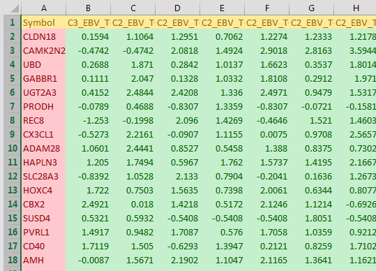
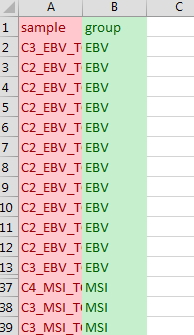

# This is the code for BCBCSF prediction. BCBCSF performs prediction based on Bayes statistics. For more information, please see the link below.

[Li, L. (2012), Bias-corrected Hierarchical Bayesian Classification with a Selected Subset of High-dimensional Features, Journal of American Statistical Association,107:497,120-134](http://amstat.tandfonline.com/doi/abs/10.1198/jasa.2011.ap10446)


## You need three datasets to execute this code.
1. trainingSet: gene signiture should have the first column as *'Symbol'* and the number should start from the second column.  
[exmaple file](example_dataset/prediction_EBVtrainingSet.txt)  



2. groupSet: This is the data divided by the group of samples in the tainingSet. You must have  *'sample','group'* column.  
[exmaple file](example_dataset/prediction_groupSet.txt)  


3. testSet: should have the same structure as tainingSet.  

[exmaple file](example_dataset/prediction_testSet.txt)  


You choose the group to train in the parameter. 
You can choose whether to do run cross-validation.
The missing value will be replaced by the median value


```{r}

#===================================================================
# Properties: user input
#-------------------------------------------------------------------
print("Choose the trainingSet.......")
in.file_trainingDataset <- file.choose()
print("Choose the groupSet.....")
in.file_group <- file.choose()
print("Choose the testSet")
in.file_testDataset <- file.choose()

group_selected <- "EBV"

Do_median_centering <- T
Do_divid_by_STD <- T

Do_cross_validation <- FALSE # you can choose "TRUE" or "FALSE"
#===================================================================


dir <- dirname(in.file_trainingDataset)
in.file.name=unlist(strsplit(basename(in.file_trainingDataset),"\\.txt"))
dir.Out <- paste0(dir,"/output_prediction_",in.file.name,"_",group_selected)


## To install Packages-------------
instPak <- function(pkg){
  new.pkg <- pkg[!(pkg %in% installed.packages()[, "Package"])]
  if (length(new.pkg))
    install.packages(new.pkg, dependencies = TRUE)
  sapply(pkg, require, character.only = TRUE)
}

#------------- Packages ----
packages <- c("ggplot2", "dplyr", "reshape2","moonBook", "readr","colorspace","BCBCSF","dendextend","amap","gplots","corrplot","Amelia")
instPak (packages)
#-----------------------------


## To install Packages-------------Bioclite

instPak_bioc <- function(pkg_b){
  new.pkg <- pkg_b[!(pkg_b %in% installed.packages()[, "Package"])]
  if (length(new.pkg)){
    source("https://bioconductor.org/biocLite.R")
    biocLite(suppressUpdates=TRUE,suppressAutoUpdate=FALSE,ask=FALSE)
    biocLite(pkg=pkg_b,suppressUpdates=TRUE, suppressAutoUpdate=FALSE,ask=FALSE)
  }
  sapply(pkg_b, require, character.only = TRUE)
}

#------------- Bioc_Packages ----
packages_bioc <- c("limma", "ctc")
instPak_bioc (packages_bioc)
#-----------------------------


## Data cleaning---------------
data_cleaning <- function(x){
  res <- list()
  res$classes <- sapply(x,function(y) class(y))
  res$na<- sapply(x,function(y) sum(is.na(y)))
  res$unique <- sapply(x, function(y) length(unique(y)))
  res$dulplicated <- sapply(x, function(y) sum(duplicated(y)))
  res$map <- missmap(x, main = "Missing values vs observed")
  return(res)
}
## duplication removal by SD----------------------
duplicateRemoverbySD <- function(x){
  matrix_data <- as.matrix(x[-1])
  sd <- apply(matrix_data,1,sd)
  order_num <- seq(1:nrow(x))
  transformed <- cbind(order_num,sd,x)
  name_3 <- colnames(transformed)[3]
  colnames(transformed)[3] <- "grouped"
  res <- transformed %>% arrange(desc(sd)) %>% group_by(grouped) %>% filter(row_number()==1) %>% ungroup() %>% arrange(order_num)
  colnames(res)[3] <- name_3
  return(res[c(-1,-2)])
}
## Transpostion XY----------------
matrixTranspositionXY <- function(x, firstColumnName="sample"){
  col_names_1 <- t(x[1])
  raw_data <- t(x[-1])
  colnames(raw_data) <- col_names_1
  raw_data <- as.data.frame(raw_data)
  row_name_1 <- row.names(raw_data)
  raw_data <- cbind(row_name_1,raw_data)
  row.names(raw_data) <- NULL
  colnames(raw_data)[1] <- firstColumnName
  raw_data[,1] <- as.character(raw_data[,1])
  return(raw_data)
}
## Median centering------------------
geneMedianCentering <- function(x){
  raw.data <- x[-1] %>% as.matrix()
  median.table <- apply(raw.data ,c(1),median,na.rm = T)
  median_centered <- raw.data-median.table
  return(cbind(x[1],median_centered))
}
## Standardization-------------
geneStandardization <- function(x){
  raw.data <- x[-1] %>% as.matrix()
  sd.table <- apply(raw.data,1,sd,na.rm = T)
  res.table_1 <- raw.data/sd.table # divided by standard deviation
  return(cbind(x[1],res.table_1))
}
transform_na_to_median <- function(x) {
  raw.data <- x[-1] %>% as.matrix()
  for (i in c(1:nrow(x))){
    temp.row <- raw.data[i,]
    median.temp <- median(temp.row,na.rm = T)
    raw.data[i,is.na(raw.data[i,])] <- median.temp
  }
  res <- cbind(x[c(1)],raw.data)
  return (res)
}


# import data
training.raw.data <- read_delim(in.file_trainingDataset,delim = "\t") %>%duplicateRemoverbySD()
colnames(training.raw.data)[1] <- c("Symbol")
training.raw.data <- training.raw.data[!(is.na(training.raw.data$Symbol)),]
training.raw.groupdata_in <- read_delim(in.file_group,delim = "\t")
colnames(training.raw.groupdata_in)[c(1,2)] <- c("sample","group") %>% na.omit()
test.raw.data <- read_delim(in.file_testDataset,delim = "\t") %>%duplicateRemoverbySD()
colnames(test.raw.data)[1] <- c("Symbol")
test.raw.data <- test.raw.data[!(is.na(training.raw.data$Symbol)),]

# Na to median

trainig_matrix_pre <- training.raw.data[-c(1)] %>% as.matrix()
test_matrix_pre <- test.raw.data[-c(1)] %>% as.matrix()
if (sum(is.na(trainig_matrix_pre)>0)){
  training.raw.data <- training.raw.data %>% transform_na_to_median
  print("Training set has NA cells. It is changed to median value")
}
x <- test.raw.data
if (sum(is.na(test_matrix_pre)>0)){
  test.raw.data <- test.raw.data %>% transform_na_to_median
  print("Test set has NA cells. It is changed to median value")
}

# median centering
if (Do_median_centering) {
  training.raw.data <- training.raw.data %>% geneMedianCentering()
  test.raw.data <- test.raw.data %>% geneMedianCentering()
  print("Two datasets are Median centered.........")
}

# standardization
if (Do_divid_by_STD) {
  training.raw.data <- training.raw.data %>% geneStandardization()
  test.raw.data <- test.raw.data %>% geneStandardization()
  print("Two datasets are standardized.........")
}


#-----------------------------------------===============-------------------


#-----------------------------------------
print("If group does not consisted of 2 groups.....,the others get together as one group as except for 'group selected'")
raw.groupdata <- training.raw.groupdata_in
raw.groupdata$group <- as.character(raw.groupdata$group)
raw.groupdata$group[raw.groupdata$group!=group_selected] <- 2
raw.groupdata$group[raw.groupdata$group==group_selected] <- 1
raw.groupdata$group <- as.character(raw.groupdata$group)
raw.groupdata$group <- as.numeric(raw.groupdata$group)

# data merging

join_dataset <- inner_join(training.raw.data,test.raw.data,by=c("Symbol"="Symbol"))
trainingSet <- join_dataset[1:ncol(training.raw.data)]
testSet <- join_dataset[c(1,(ncol(training.raw.data)+1):ncol(join_dataset))]
groupSet <- raw.groupdata

# data processing
trainingSet_t <- trainingSet %>% matrixTranspositionXY()
testSet_t <- testSet %>% matrixTranspositionXY()

join_dataset <- inner_join(trainingSet_t,groupSet,by=c("sample"="sample"))
trainingSet_t <- join_dataset[1:ncol(trainingSet_t)]
groupSet <- join_dataset[c(1,(ncol(trainingSet_t)+1):ncol(join_dataset))]

# write datset for BCCP
BCCPset_training_g <- groupSet
BCCPset_training_g$group_name <- BCCPset_training_g$sample %>% as.character()
BCCPset_training_g$group[BCCPset_training_g$group == "1"] <- "S_"
BCCPset_training_g$group[BCCPset_training_g$group == "2"] <- "z_"
BCCPset_training_g$group_name <- paste0(BCCPset_training_g$group,BCCPset_training_g$sample)

BCCPset_training <- cbind(BCCPset_training_g[-c(1,2)],trainingSet_t)[-c(2)] %>% arrange(group_name) %>% matrixTranspositionXY()
BCCPset_training_testset <- inner_join(BCCPset_training,testSet,by=c("sample"="Symbol"))
colnames(BCCPset_training_testset)[1] <- "geneSymbol"
####################### BCBCSF -------------------
## training data
X_tr <- trainingSet_t[-1] %>% as.matrix()
y_tr <- groupSet$group
## test data
X_ts <- testSet_t[-1] %>% as.matrix()
y_ts <- testSet_t[1]

##########################################################################
######################## training and prediction #########################
##########################################################################
## fitting training data with top features selected by F-statistic
out_fit <- bcbcsf_fitpred (X_tr = X_tr, y_tr = y_tr, nos_fsel = c(ncol(X_tr)))
## note 1: if 'X_ts' is given above, prediction is made after fitting
## note 2: no_rmc = 100 is too small, omit it and use the default

## predicting class labels of test cases
out_pred <- bcbcsf_pred (X_ts = X_ts, out_fit = out_fit)


# result write
if(!file.exists(dir.Out))dir.create(dir.Out)

res <- out_pred$array_probs_pred %>% as.data.frame() # probality table -----
res.class <- apply(res,1,which.max) # which class -----
res.proba <- apply(res,1,max) # probality -----
resultTable <- cbind(y_ts,res,res.proba,res.class)
colnames(resultTable) <- c("sample",paste("probaility of",group_selected),"probaility of Others","Max_prob","group")
resultTable$group[resultTable$group=="1"] <- group_selected
resultTable$group[resultTable$group=="2"] <- "others"
write_delim(x = resultTable,path = file.path(dir.Out,"0_prediction_result.txt"),delim = "\t")
write_delim(x = testSet,path = file.path(dir.Out,"1_fitered_testset.txt"),delim = "\t")

##########################################################################
####################### visualizing prediction results ###################
##########################################################################
## reload one bcbcsf fit result from hardrive
fit_bcbcsf <- reload_fit_bcbcsf (out_fit$fitfiles[1])
## the fitting result for no_fsel = 50 can be retrieved directly from
## out_fit:
fit_bcbcsf_fsel50 <- out_fit$fit_bcbcsf
## summarize the fitting result
sum_fit <- bcbcsf_sumfit (fit_bcbcsf)

## visualize fitting result
png(file.path(dir.Out,"summary.png"),width = 700, height = 500,pointsize = 12, bg = "white")
bcbcsf_plotsumfit (sum_fit)
dev.off()


if(Do_cross_validation){
  ##########################################################################
  ############################ cross validation ############################
  ##########################################################################
  ## doing cross validation with bcbcsf_fitpred on lymphoma data
  cv_pred <- cross_vld (
    ##################### classifier, data, and fold ###################
    fitpred_func = bcbcsf_fitpred, X = X_tr, y = y_tr,
    ################ all other arguments passed classifier ############
    nos_fsel = c(ncol(X_tr)))
  ## note: no_rmc = 100 is too small, omit it and use the default in practice

  ## evaluate prediction given true labels
  validation <- eval_pred (out_pred = cv_pred, y_ts = y_tr)
  val_probs_at_truelabels <- validation$probs_at_truelabels %>% as.data.frame()
  val_probs_at_truelabels <- cbind(groupSet,val_probs_at_truelabels)
  val_probs_at_truelabels$group[val_probs_at_truelabels$group=="1"] <- group_selected
  val_probs_at_truelabels$group[val_probs_at_truelabels$group=="2"] <- "others"
  colnames(val_probs_at_truelabels)[3] <- "probability_at_truelabels"
  val_summary <- validation$summary

  write_delim(x = val_probs_at_truelabels,path = file.path(dir.Out,"crossVaildation.txt"),delim = "\t")
  write_delim(x = val_summary,path = file.path(dir.Out,"crossVaildation_summary.txt"),delim = "\t")
  # AMLP: minus average log probabilities at true labels, often called "deviation"


  ## warning: this function is slow if nfold is large; if you have a
  ## computer cluster, you better parallel the cross validation folds.
  ##
}
############# HEATMAP FOR RESULT
# grouping
data.process <- testSet
data.process_1<- testSet_t
resultTable$group[resultTable$group==group_selected] <- "1"
resultTable$group[resultTable$group=="others"] <- "2"
group.res <- resultTable[c("sample","group")]
groupdata <- group.res %>% arrange(group)
groupdata$group <- as.factor(groupdata$group )
a_group <- groupdata %>% filter(group==levels(groupdata$group)[1])
b_group <- groupdata %>% filter(group==levels(groupdata$group)[2])

if (nrow(a_group)==0 | nrow(b_group)==0){
  print("Heatmap can not be drawn, because there is only one group")
}else {
data.process_1_a <- inner_join(a_group,data.process_1,by=c("sample"="sample"))[-2] %>% matrixTranspositionXY()
data.process_1_b <- inner_join(b_group,data.process_1,by=c("sample"="sample"))[-2] %>% matrixTranspositionXY()

# sorting by average difference

res.table <- matrix(nrow = 1,ncol = 1)
data.process_1_a_m <- data.process_1_a[c(2:ncol(data.process_1_a))] %>% as.matrix()
data.process_1_b_m <- data.process_1_b[c(2:ncol(data.process_1_b))] %>% as.matrix()
for (i in 1:nrow(data.process_1_a)) {
  k_1 <- data.process_1_a_m[i,]
  k_2 <- data.process_1_b_m[i,]
  average_d <- mean(k_1,na.rm = T)-mean(k_2,na.rm = T)
  # t_p <- t.test(k_1,k_2)
  # t_p <- t_p$p.value
  res.tem <- matrix(c(average_d),nrow = 1,ncol = 1)
  res.table <- rbind(res.table,res.tem)
}
res.table <- res.table[-1,] %>% as.data.frame()
res.table <- cbind(data.process_1_a[1],res.table)
colnames(res.table) <- c("gene","average_d")

filinterd_list <- res.table %>% arrange(average_d)
flitered_table <- inner_join(filinterd_list,data.process_1_a,by=c("gene"="sample"))
flitered_table <- inner_join(flitered_table,data.process_1_b,by=c("gene"="sample"))[-c(2)]

# drawing supervised cluster----------------------------------------------------------------

flitered_table_medianCentering <- geneMedianCentering(flitered_table)
data.clustering_heatmap <- flitered_table_medianCentering[-1]

row.names(data.clustering_heatmap) <- t(flitered_table_medianCentering[1])
strip_colors <- rainbow_hcl(length(levels(groupdata$group)))[as.numeric(groupdata$group)]


data_melted <- melt(data.clustering_heatmap,id.vars = 0)
intensity_heatmap <- 0.30
v_1 <- quantile(data_melted$value,probs = intensity_heatmap)
v_2 <- quantile(data_melted$value,probs = (1-intensity_heatmap))
colors_break = unique(c(seq(min(data_melted$value),v_1,length=100),seq(v_1,v_2,length=100),seq(v_2,max(data_melted$value),length=100)))
my_palette <- colorRampPalette(c("green", "black", "red"))(n = 297)

if(!file.exists(dir.Out))dir.create(dir.Out)
cairo_pdf(file.path(dir.Out,"supervisedHeatmap.pdf"),width = 15, height = 10,pointsize = 12)

heatmap.2(as.matrix(data.clustering_heatmap),
          # main = "Heatmap for the data set",
          # srtCol = 20,
          dendrogram = "none",
          Rowv = F,
          Colv = F, # this to make sure the columns are not ordered
          # margins =c(5,0.1),
          # key.xlab = "Cm",
          # denscol = "grey",
          density.info = "density",
          breaks=colors_break,
          #RowSideColors = strip_colors, # to add nice colored strips
          ColSideColors = strip_colors,
          col = my_palette,
          trace="none",
          cexRow = 0.3,
          symm=F,symkey=F,symbreaks=T, scale="none"
)

dev.off()

bmp(file.path(dir.Out,"supervisedHeatmap.bmp"),width = 1000, height = 700,pointsize = 12, bg = "white")
heatmap.2(as.matrix(data.clustering_heatmap),
          # main = "Heatmap for the data set",
          # srtCol = 20,
          dendrogram = "none",
          Rowv = F,
          Colv = F, # this to make sure the columns are not ordered
          # margins =c(5,0.1),
          # key.xlab = "Cm",
          # denscol = "grey",
          density.info = "density",
          breaks=colors_break,
          #RowSideColors = strip_colors, # to add nice colored strips
          ColSideColors = strip_colors,
          col = my_palette,
          trace="none",
          cexRow = 0.3,
          symm=F,symkey=F,symbreaks=T, scale="none"
)
dev.off()

write_delim(x = flitered_table,path = file.path(dir.Out,"2_table_supervisedClustering.txt"),delim = "\t")
}
write_delim(x = BCCPset_training_testset,path = file.path(dir.Out,"3_table_ForBCCP.txt"),delim = "\t")


```

