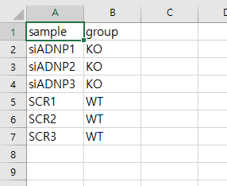

DESeq2 reference article   
[Moderated estimation of fold change and dispersion for RNA-seq data with DESeq2](https://genomebiology.biomedcentral.com/articles/10.1186/s13059-014-0550-8)

DESeq2 manual   
[Analyzing RNA-seq data with DESeq2](https://www.bioconductor.org/packages/devel/bioc/vignettes/DESeq2/inst/doc/DESeq2.html#input-data)  


# This code provides RNA sequencing normalization data and computation of differential expression.  
The RNASeq matrix must have the following structure and must be a non-normalized count matrix.
  

The group data must consist of two columns. The first line should contain the sample name and the second line should contain group.  


  
Finally, specify the group to be the reference (denominator) in the code.  

```{r}
#===================================================================
# Properties: user input
#-------------------------------------------------------------------
print("RNASeq matrix..............")
in.file.matrix <- file.choose()
print("group data containing two columns,'sample' and 'group'.......")
in.file.group <- file.choose()


reference_group <- "WT"

#===================================================================

dir     <- dirname(in.file.matrix)
dirOut <- paste0(dir,"/output_DESeq2")
if(!file.exists(dirOut)){  dir.create(dirOut)} # Creat output data

library(kasaBasicFunctions)
# install Kang's basic functions package from the git-hub
#------------- Packages ----
packages <- c("ggplot2", "dplyr", "readr", "data.table","tibble","pheatmap")
kasa.instPak (packages)
#-----------------------------
#------------- Bioc_Packages ----
packages_bioc <- c("DESeq2")
kasa.instPak_bioc (packages_bioc)
#-----------------------------


data.raw <- fread(in.file.matrix) %>% as.data.frame()
groupData <- fread(in.file.group)%>% as.data.frame()
colnames(groupData) <- c("sample","group")
colnames(data.raw)[1] <- "gene"

# data matching
data.raw.t <- data.raw %>% kasa.transposeMatrix()
tmp <- kasa.matchingRow(groupData,data.raw.t,keycolX = "sample",keycolY ="sample")
groupData <- tmp$dataframeX
data.raw <- tmp$dataframeY %>% kasa.transposeMatrix()

# data preparation
dataMatrix <- data.raw[-1] %>% as.matrix()
rownames(dataMatrix) <- data.raw[1] %>% t %>% as.vector()

groupData.matrix <- groupData[-1] 
groupData.matrix$group <- groupData.matrix$group %>% as.factor()
rownames(groupData.matrix) <- groupData[1] %>% t %>% as.vector()

# dds processing
dds <- DESeqDataSetFromMatrix(countData = dataMatrix,colData = groupData.matrix,design = ~group)
dds$group <- relevel(dds$group, ref=reference_group)
dds <- DESeq(dds)


res <- results(dds)
resLFC <- lfcShrink(dds, coef=2, res=res)

res.table <- as.data.frame(res)
res.LFC.table <- as.data.frame(resLFC)
normalizedTable <- log2(counts(dds,normalized=TRUE)+1)

res.merged <- cbind(res.table,res.LFC.table$log2FoldChange,normalizedTable)
res.merged <- rownames_to_column(res.merged)
colnames(res.merged)[c(1,8)] <- c("gene","lfcShrink")
write_csv(res.merged,paste0(dirOut,"/DE_reference_",reference_group,".csv"))

# DESeq2 output plot
png(paste0(dirOut,"/DESeq2_preLFCshinkage.png"),width = 700, height = 500,pointsize = 12, bg = "white")
  plotMA(res)
dev.off()
png(paste0(dirOut,"/DESeq2_LFCshinkage.png"),width = 700, height = 500,pointsize = 12, bg = "white")
plotMA(resLFC)
dev.off()

# Regularized log transformation nomalizaton
rld <- rlog(dds, blind=FALSE)
rld.table <- assay(rld)
write_csv(rownames_to_column(as.data.frame(rld.table)),paste0(dirOut,"/Regularized_log_transformation.csv"))

# variance stabilizing transformations (VST)
vsd <- varianceStabilizingTransformation(dds, blind=FALSE)
vsd.table <- assay(vsd)
write_csv(rownames_to_column(as.data.frame(vsd.table)),paste0(dirOut,"/variance_stabilizing_transformation.csv"))

png(paste0(dirOut,"/normalization.png"),width = 1000, height = 700,pointsize = 12, bg = "white")
par(mfrow=c(4,1))
boxplot(dataMatrix,main="Raw data")
boxplot(normalizedTable,main = "DESeq2 normalization")
boxplot(rld.table,main = "Regularized log transformation")
boxplot(vsd.table,main = "Variance stabilizing transformation")
par(mfrow=c(1,1))
dev.off()


```

