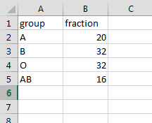
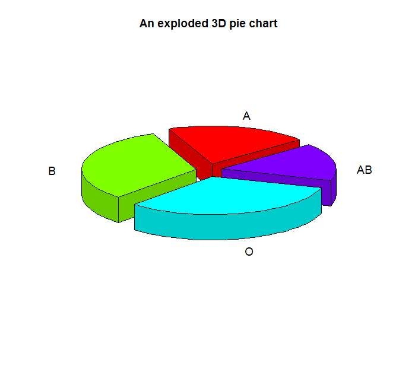

# This is the code for drawing 3D Pie chart, exploding type.

The data must have two columns named "group" and "fraction".  



Then the result is as follows.    



You will get the output in pdf, editable in coreldraw.  

```{r}


#===================================================================
# Properties: user input
#-------------------------------------------------------------------
in.file <- file.choose()
#===================================================================
dir <- dirname(in.file)

dirOut <- paste0(dir,"/output_3DPiePlot")
if(!file.exists(dirOut)){dir.create(dirOut)}

in.file.name <- unlist(strsplit(basename(in.file),"\\.txt"))
out.file <- paste(dirOut,"/",in.file.name,"_","3DPieChart.pdf",sep="")

# install Kang's basic functions package from the git-hub
if ("devtools" %in% installed.packages()[, "Package"]){cat("devtools is installed")}else(install.packages("devtools"))

devtools::install_github("kasaha1/kasaBasicFunctions")
library(kasaBasicFunctions)
# install Kang's basic functions package from the git-hub
#------------- Packages ----
packages <- c("ggplot2", "dplyr", "readr", "data.table","plotrix")
kasa.instPak (packages)

# file read 
data.raw <- fread(in.file) %>% as.data.frame()

cairo_pdf(out.file,width = 15, height = 10,pointsize = 12)
pie3D(data.raw$fraction, labels = data.raw$group, main = "An exploded 3D pie chart", explode=0.1, radius=.9, labelcex = 1.2,  start=0.7)
dev.off()

```

