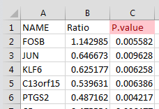

We need dataset for FDR including the column, "P.value" exactly.




```{r}

#===================================================================
# Properties: user input
#-------------------------------------------------------------------
print("Choose the dataSet.......")
in.file_Dataset <- file.choose()

#===================================================================


dir <- dirname(in.file_Dataset)
in.file.name=unlist(strsplit(basename(in.file_Dataset),"\\.txt"))
dir.Out <- paste0(dir,"/FDR_",in.file.name)

if (!dir.exists(dir.Out)) {
  dir.create(dir.Out)
}

data.raw <- read_delim(in.file_Dataset, delim = "\t")
p <- data.raw$P.value

## or all of them at once (dropping the "fdr" alias):
p.adjust.M <- p.adjust.methods[p.adjust.methods != "fdr"]
p.adj    <- sapply(p.adjust.M, function(meth) p.adjust(p, meth))
# p.adj.300 <- sapply(p.adjust.M, function(meth) p.adjust(p, meth, n = 249))
# stopifnot(identical(p.adj[,"none"], p), p.adj <= p.adj.60)
# round(p.adj, 3)
## or a bit nicer:
# noquote(apply(p.adj, 2, format.pval, digits = 3))
res <- cbind(data.raw,p.adj)
write_delim(res,file.path(dir.Out,"FDR.txt"), delim = "\t")


## and a graphic:
png(file.path(dir.Out,"plot.png"),width = 700, height = 500,pointsize = 12, bg = "white")

matplot(p, p.adj, ylab="p.adjust(p, meth)", type = "l", asp = 1, lty = 1:6,
        main = "P-value adjustments")
legend(0.7, 0.6, p.adjust.M, col = 1:6, lty = 1:6)

dev.off()

```

