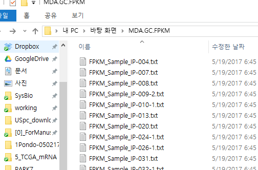
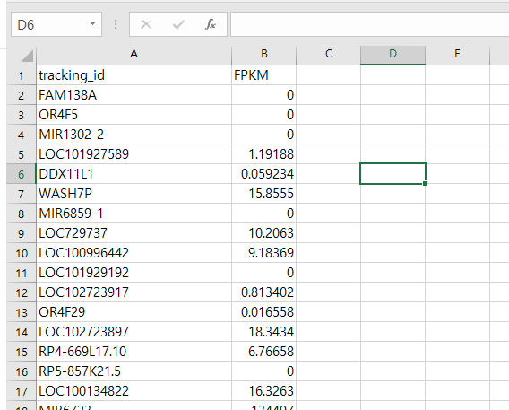

This is a code that combines several gene expression files in one folder into one file.
For example, there are several files in a folder that have the following names:  




These files have the following format: (NOTE: The column name is not important. Only the column order is important.ex: gene, expression value)  

  


When you run the entire program at once, a window to select the folder appears. If you select folder, the rest of the operation will proceed automatically.

Duplicate values with the same gene name will be removed leaving only the largest value.

```{r}

# directory choose
workingDirectoy <- choose.dir()
setwd(workingDirectoy)

# get file list
file.list <- list.files(pattern = ".*.txt")

# install Kang's basic functions package from the git-hub
kasa.instPak <- function (pkg) 
{
  new.pkg <- pkg[!(pkg %in% installed.packages()[, "Package"])]
  if (length(new.pkg)) 
    install.packages(new.pkg, dependencies = TRUE)
  sapply(pkg, require, character.only = TRUE)
}
#------------- Packages ----
packages <- c("dplyr", "readr", "data.table","devtools","reshape2")
kasa.instPak (packages)

# merging processing
res.table <- matrix(nrow = 1,ncol = 3)
for (i in file.list) {
  # i <- "FPKM_Sample_IP-004.txt"
  file.name <- unlist(strsplit(basename(i),"\\.txt"))
  
  # file read
  tmp.data <- read_delim(i,delim = "\t")
  tmp.data.1 <- cbind(file.name,tmp.data) %>% as.matrix()
  
  res.table <- rbind(res.table,tmp.data.1)
}
cat("merging......")
res.table <- res.table[-1,] %>% as.data.frame() # merging result
colnames(res.table) <- c("sample","gene","expression")
res.table[1:3] <- lapply(res.table[1:3],as.character)
res.table$expression <- res.table$expression %>% as.numeric()
cat("merging complete......  duplication removal start")

# duplication removal
group.col <- c("sample","gene")
res.table.1 <- res.table %>% group_by_(.dots = group.col) %>% arrange(desc(expression)) %>% filter(row_number()==1) %>% ungroup()
num.dup <- paste0("The number of removed value is ",(nrow(res.table)-nrow(res.table.1)),", because of duplication.")
print(num.dup)
cat("duplication removed....")

# data reconstrion to wide form
res.table.2 <- dcast(data = res.table.1,formula = gene~sample,value.var = "expression")

# output
cat("output...")
if(!file.exists("output")) {dir.create("output")} #ouput directory setting
setwd("output")
write_delim(res.table.2,"meergedFile.txt",delim = "\t")
cat("Done")

```

