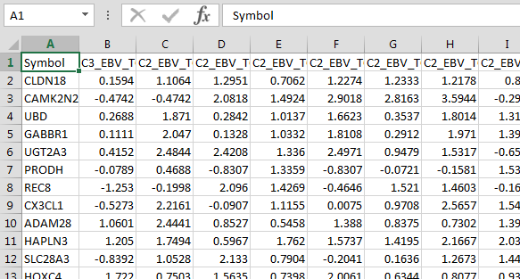
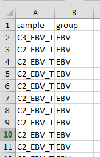

# To preapre data

### Dataset
    

_NA will be replaced by the value of median._


### Groupset    
    

```{r}

#===================================================================
# Properties: user input
#-------------------------------------------------------------------
print("Choose the dataSet.......")
in.file_Dataset <- file.choose()
print("Choose the groupSet.....")
in.file_group <- file.choose()

Do_median_centering <- T # median centering
Do_divid_by_STD <- T # standardization


#===================================================================


dir <- dirname(in.file_Dataset)
in.file.name=unlist(strsplit(basename(in.file_Dataset),"\\.txt"))
dir.Out <- paste0(dir,"/PAC3D_",in.file.name)

if (!dir.exists(dir.Out)) {
  dir.create(dir.Out)
}

## To install Packages-------------
instPak <- function(pkg){
  new.pkg <- pkg[!(pkg %in% installed.packages()[, "Package"])]
  if (length(new.pkg)) 
  install.packages(new.pkg, dependencies = TRUE)
  sapply(pkg, require, character.only = TRUE)
}

## Transpostion XY----------------
matrixTranspositionXY <- function(x, firstColumnName="sample"){
  col_names_1 <- t(x[1])
  raw_data <- t(x[-1])
  colnames(raw_data) <- col_names_1
  raw_data <- as.data.frame(raw_data)
  row_name_1 <- row.names(raw_data)
  raw_data <- cbind(row_name_1,raw_data)
  row.names(raw_data) <- NULL
  colnames(raw_data)[1] <- firstColumnName
  raw_data[,1] <- as.character(raw_data[,1])
  return(raw_data)
}
# Median centering------------------
geneMedianCentering <- function(x){
raw.data <- x[-1] %>% as.matrix()
median.table <- apply(raw.data ,c(1),median,na.rm = T)
median_centered <- raw.data-median.table
return(cbind(x[1],median_centered))
}

# Transfomr_NA_to_Median
transform_na_to_median <- function(x) {
raw.data <- x[-1] %>% as.matrix()
for (i in c(1:nrow(x))){
temp.row <- raw.data[i,]
median.temp <- median(temp.row,na.rm = T)
raw.data[i,is.na(raw.data[i,])] <- median.temp
}
res <- cbind(x[c(1)],raw.data)
return (res)
}

# Standardization-------------
## is.NAN function
is.nan.data.frame <- function(x){
do.call(cbind, lapply(x, is.nan))}

geneStandardization <- function(x){
raw.data <- x[-1] %>% as.matrix()
sd.table <- apply(raw.data,1,sd,na.rm = T)
res.table_1 <- raw.data/sd.table # divided by standard deviation
res <- cbind(x[1],res.table_1)
res[is.nan(res)] <- 0
return(res)
}


#------------- Packages ----
packages <- c("ggplot2", "dplyr", "reshape2","moonBook", "readr","colorspace","pca3d","magick")
instPak (packages) 
#-----------------------------


# data import
data.raw <- read_delim(in.file_Dataset, delim = "\t")
group.raw <- read_delim(in.file_group, delim = "\t")
colnames(group.raw) <- c("sample","group")

# data processing

## NA to median.
data.raw <- data.raw %>% transform_na_to_median()
## median centering
if (Do_median_centering) {
  data.raw <- data.raw %>% geneMedianCentering()
    print("The dataset is Median centered.........")
}
## standardization
if (Do_divid_by_STD) {
  data.raw <- data.raw %>% geneStandardization()
    print("The dataset is Standardized.........")
}

data.PCA <- data.raw %>% matrixTranspositionXY
data_temp <- inner_join(data.PCA,group.raw,by=c("sample"="sample"))
data.PCA <- data_temp[c(1:ncol(data.PCA))]
data.group <- data_temp[c(1,ncol(data_temp))]
data.group$group <- as.factor(data.group$group)


pca <- prcomp( data.PCA[,-1], scale.= TRUE )
pca3d( pca, group= data.group[,2],
fancy= F, bg= "white",
axes.color= "dimgray", new= T,show.group.labels=T
# ,palette = c("#00AFEF","#00A859","#C8C5E2","#F5874F","#A8518A","#ED3237")
)
makeMoviePCA(dir=dir.Out)
snapshotPCA3d(file.path(dir.Out,"PCA3D.png"))

# levels(data.group[,2])

```

