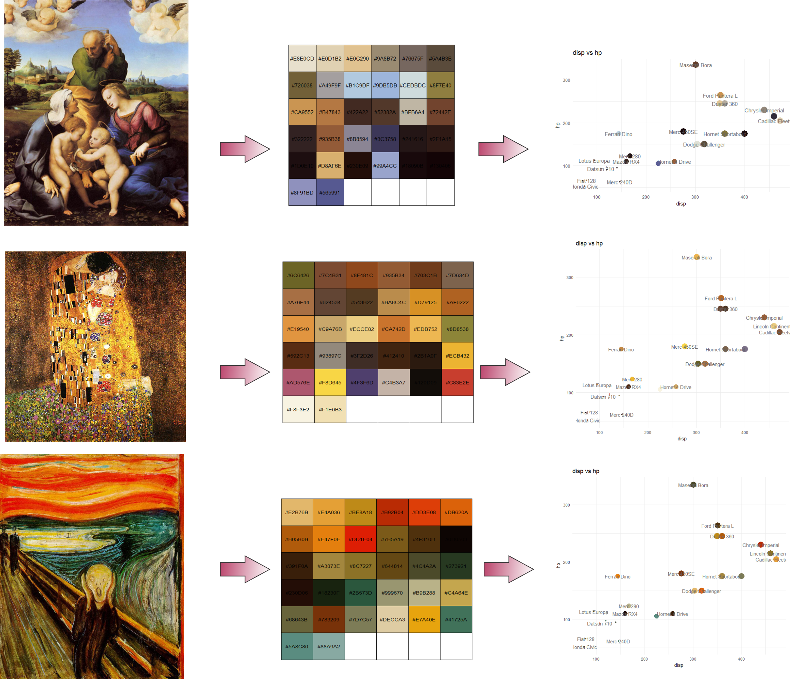

# paletter
build your palette from a picture   
[source](https://www.r-bloggers.com/how-to-build-a-color-palette-from-any-image-with-r-and-k-means-algo/)   

You can make a palette from the picture  
  

After installation of "paletter" package from Git-Hub, simply you can use like that :  
    
```{r}
library(paletter)
colours_vector <- palette_maker(PictureFilePath, number_of_colors = 20) 
```


all code is  
```{r}
#-----Input number of color---------
numOfcolor <- 32
#-----------------------------------


# install Kang's basic functions package from the git-hub
if ("devtools" %in% installed.packages()[, "Package"]){cat("devtools is installed")}else(install.packages("devtools"))

devtools::install_github("kasaha1/kasaBasicFunctions")

library(kasaBasicFunctions)
# install Kang's basic functions package from the git-hub
#------------- Packages ----
packages <- c("ggplot2", "dplyr", "readr", "data.table","jpeg","scales","paletter")
kasa.instPak (packages)
devtools::install_github("andreacirilloac/paletter")


# download.file("https://andreacirilloac.github.io/dataviz/images/sacra_famiglia_canigiani.jpg", "image.jpg")
painting     <- readJPEG("figures/a18.jpg")

dimension    <- dim(painting)
painting_rgb <- data.frame(
  x = rep(1:dimension[2], each = dimension[1]),
  y = rep(dimension[1]:1, dimension[2]),
  R = as.vector(painting[,,1]), #slicing our array into three
  G = as.vector(painting[,,2]),
  B = as.vector(painting[,,3])
)
k_means        <- kmeans(painting_rgb[,c("R","G","B")], centers = numOfcolor, iter.max = 30)
show_col(rgb(k_means$centers))
rgb(k_means$centers)

#----------- simply-------------------
colours_vector <- palette_maker("figures/a18.jpg", number_of_colors = numOfcolor) #### 


#-----check------

ggplot(data = mtcars, aes(
  x = disp,
  y = hp,
  color = rownames(mtcars)
))+geom_point(stat = 'identity', aes(size = cyl))+scale_color_manual(values = colours_vector)+theme_minimal()+geom_text(label = rownames(mtcars),color = 'grey40',check_overlap = TRUE) +  guides(size = FALSE) +  theme(legend.position ="none") +  labs(title = "disp vs hp")
```

